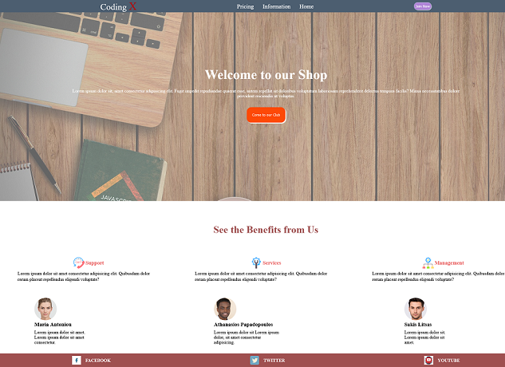

# Landing Page

## Table of contents

- [Overview](#overview)
  - [The challenge](#the-challenge)
  - [Links](#links)
- [My process](#my-process)
  - [Built with](#built-with)
  - [What I learned](#what-i-learned)
  - [Continued development](#continued-development)
  - [Useful resources](#useful-resources)
- [Author](#author)

## Overview
 
### The challenge

It is a basic understanding of HTML and CSS. The challenge is to build out this landing and get it looking beautiful with nice UI and mobile responsive.

### Links

- Solution URL: (https://github.com/pandelislag/landing-code)
- Live Site URL: (https://pandelislag.github.io/landing-code/)

## My process

### Built with

- HTML5 
- CSS 
- Flexbox

### What I learned

This project help me improve my coding skills by building this realistic project. I learn how to search some basic information about html and css like margin, padding and fonts. I also tried to understand the technology of flexbox and how useful this tool is to create a responsive website.

### Continued development

In future projects i would like to learn more consepts about vannilla Js and try out new techniques. Also i want to try learn some libraries of css like bootstrap5 and Sass to make my code more usefull and more effecient. 

### Useful resources
This helped me with the building process and answered all my questions:
- [Resource 1](https://developer.mozilla.org/).
- [Resource 2](https://www.w3schools.com/css/css_rwd_mediaqueries.asp).
- [Resource 3](https://stackoverflow.com/).
- [Resource 4](https://www.freecodecamp.org/).

## Author

- Website - [Pantelis](https://github.com/pandelislag)
